# Federico Lora

# Índice
1. [Repositorio masteruah](#repositorio-masteruah)
2. [README](#readme)
3. [Commit inicial](#commit-inicial)
4. [Push inicial](#push-inicial)
5. [Añadir fichero 1.txt](#añadir-fichero-1txt)
6. [Crear el tag v0.1](#crear-el-tag-v01)
7. [Crear una rama v0.2](#crear-una-rama-v02)
8. [Añadir fichero 2.txt](#añadir-fichero-2txt)
9. [Merge directo](#merge-directo)
10. [Merge con conflicto](#merge-con-conflicto)
11. [Listado de ramas](#listado-de-ramas)
12. [Borrar rama](#borrar-rama)
13. [Listado de cambios](#listado-de-cambios)
14. [Cuenta de GitHub](#cuenta-de-github)
15. [Uso social de GitHub](#uso-social-de-github)
16. [Crear tabla en README.md](#crear-tabla-en-readmemd)
17. [Colaboradores](#colaboradores)
18. [Crear organización](#crear-organización)
19. [Crear equipos](#crear-equipos)
20. [Crear index.html](#crear-indexhtml)
21. [Crear Pull-requests](#crear-pull-requests)
22. [Gestionar Pull-requests](#gestionar-pull-requests)


<!-- ====================== PASO 1 ====================== -->
## Repositorio masteruah
1. Crear un repositorio en GitHub llamado **masteruah_fede_borrar**.

2. Clonar el repositorio en local usando PowerShell desde VSCode:

```powershell
cd "F:\Fede\Clase\DAM\1º DAM\Entornos de desarrollo\Tema 4\"
git clone https://github.com/Fedes10/masteruah_fede_borrar
cd masteruah_fede_borrar
```
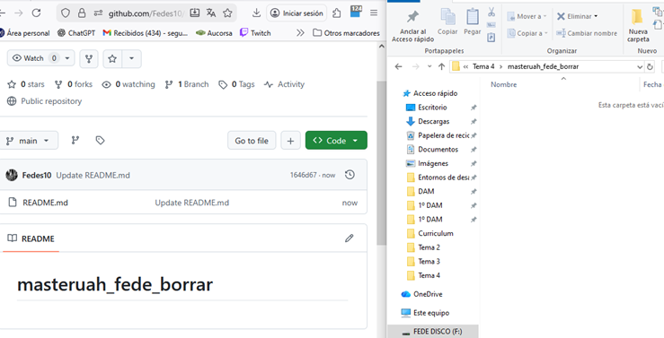


<!-- ====================== PASO 2 ====================== -->
## README
1. Crear (si no existe) un archivo **README.md** dentro de tu carpeta local:

```powershell
New-Item README.md -ItemType File
```

2. Abrirlo en VSCode y añadir explicaciones, comandos y capturas que vayas usando.

> Nota: Aquí es donde documentarás **todo lo que haces en los siguientes pasos**.
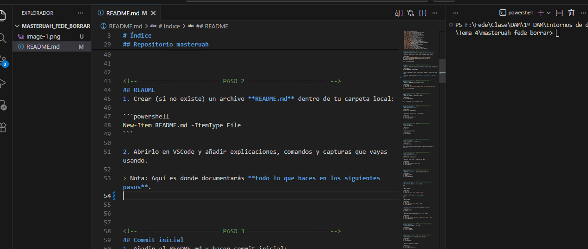


<!-- ====================== PASO 3 ====================== -->
## Commit inicial
1. Añadir al README.md y hacer commit inicial:

```powershell
git add README.md
git commit -m "Commit inicial: README creado con explicación de pasos"
```
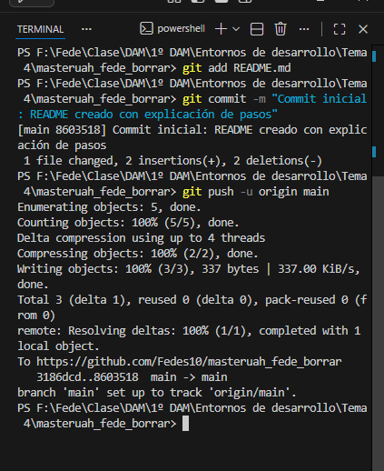


<!-- ====================== PASO 4 ====================== -->
## Push inicial
1. Subir los cambios al repositorio remoto:

```powershell
git push origin master
```
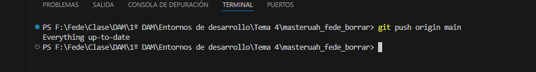


<!-- ====================== PASO 5 ====================== -->
## Añadir fichero 1.txt
1. Crear un archivo **1.txt**:

```powershell
New-Item 1.txt -ItemType File
```
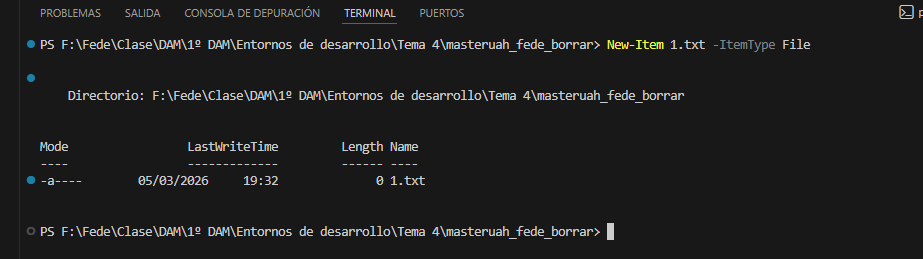

2. Añadirlo al control de Git y hacer commit:

```powershell
git add 1.txt
git commit -m "Añadido 1.txt"
git push origin master
```
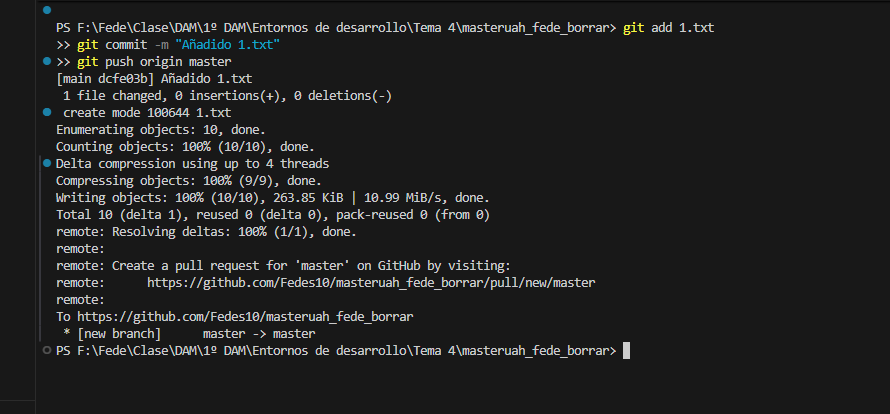


<!-- ====================== PASO 6 ====================== -->
## Crear el tag v0.1
1. Crear un tag local:

```powershell
git tag v0.1
```
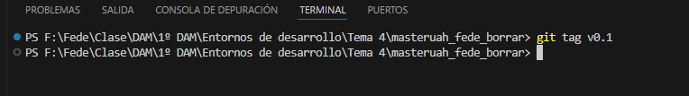

2. Subir el tag al remoto:

```powershell
git push origin v0.1
```
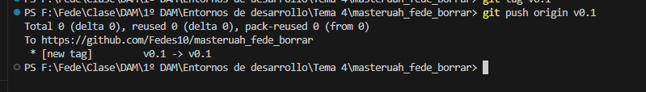


<!-- ====================== PASO 7 ====================== -->
## Crear una rama v0.2
1. Crear y cambiarte a la rama **v0.2**:

```powershell
git checkout -b v0.2
```
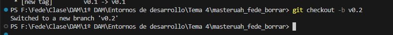


<!-- ====================== PASO 8 ====================== -->
## Añadir fichero 2.txt
1. Crear un archivo **2.txt**:

```powershell
New-Item 2.txt -ItemType File
```
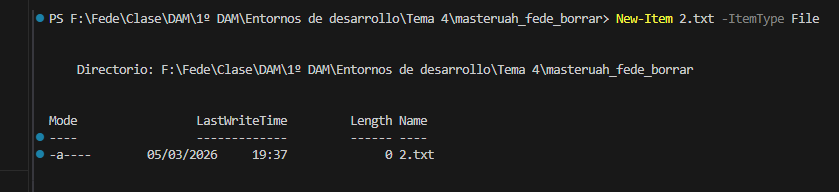

2. Añadirlo, hacer commit y push a la rama v0.2:

```powershell
git add 2.txt
git commit -m "Añadido 2.txt en v0.2"
git push origin v0.2
```
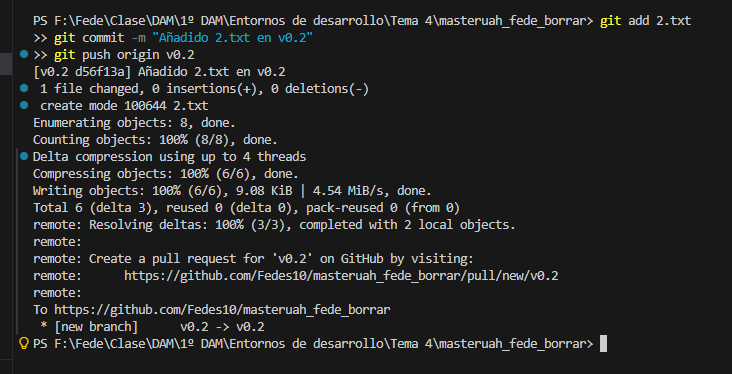


<!-- ====================== PASO 9 ====================== -->
## Merge directo
1. Cambiarte a **master** y hacer merge directo de v0.2:

```powershell
git checkout master
git merge v0.2
git push origin master
```
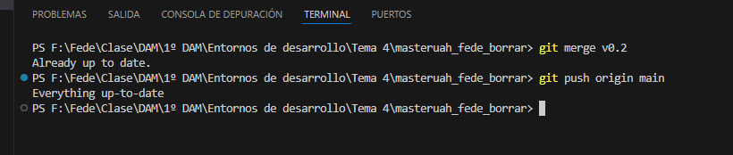


<!-- ====================== PASO 10 ====================== -->
## Merge con conflicto
1. En **master**, edita **1.txt** y añade:
```
Hola
```
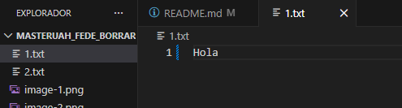

2. Hacer commit:

```powershell
git add 1.txt
git commit -m "Editar 1.txt en master: Hola"
```
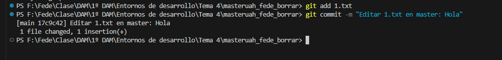

3. Cambiar a v0.2, editar **1.txt** y añadir:
```
Adios
```


4. Hacer commit:

```powershell
git add 1.txt
git commit -m "Editar 1.txt en v0.2: Adios"
git push origin v0.2
```


5. Volver a **master** y hacer merge (aparecerá conflicto):

```powershell
git checkout master
git merge v0.2
```
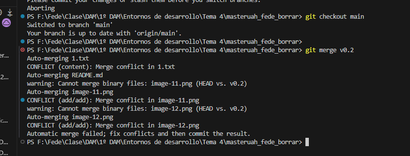

6. Resolver conflicto manualmente en **1.txt**, luego:

```powershell
git add 1.txt
git commit -m "Resuelto conflicto de merge entre master y v0.2"
git push origin master
```
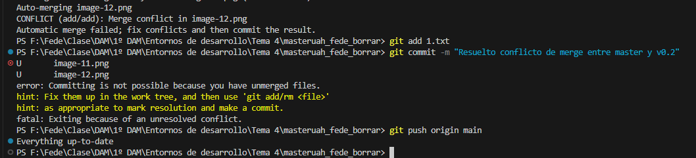


<!-- ====================== PASO 11 ====================== -->
## Listado de ramas
1. Listar ramas con merge y sin merge:

```powershell
git branch --merged
git branch --no-merged
```
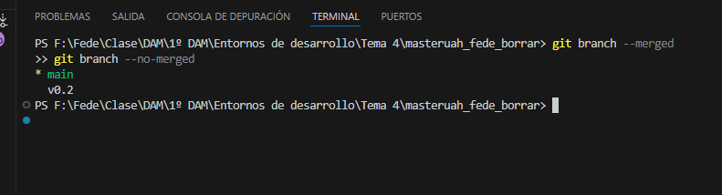


<!-- ====================== PASO 12 ====================== -->
## Borrar rama
1. Crear un tag **v0.2** antes de borrar la rama:

```powershell
git tag v0.2
git push origin v0.2
```

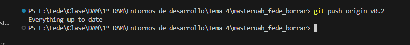

2. Borrar la rama local y remota:

```powershell
git branch -d v0.2
git push origin --delete v0.2
```


<!-- ====================== PASO 13 ====================== -->
## Listado de cambios
1. Ver commits, ramas y tags:

```powershell
git log --oneline --graph --all --decorate
```


<!-- ====================== PASO 14 ====================== -->
## Cuenta de GitHub
1. Cambiar foto de perfil en GitHub.
2. Activar doble factor de autenticación.
3. Añadir tu clave pública al repositorio si no lo hiciste:

```powershell
ssh-keygen -t ed25519 -C "tu_email@example.com"
cat ~/.ssh/id_ed25519.pub
```

Luego copiar el contenido al perfil de GitHub.


<!-- ====================== PASO 15 ====================== -->
## Uso social de GitHub
1. Buscar nombres de usuario de tus compañeros y seguirlos.
2. Añadir estrellas a sus repositorios.


<!-- ====================== PASO 16 ====================== -->
## Crear tabla en README.md
1. Añadir tabla con info de compañeros:

|        NOMBRE          |                     GITHUB                        |
|------------------------|---------------------------------------------------|
| Nombre del compañero 1 | [enlace a github 1](http://github.com/i12vecaj) |
| Nombre del compañero 2 | [enlace a github 2](http://github.com/i12vecaj) |
| Nombre del compañero 3 | [enlace a github 3](http://github.com/i12vecaj) |


<!-- ====================== PASO 17 ====================== -->
## Colaboradores
1. Poner a [github.com/i12vecaj](http://github.com/i12vecaj) como colaborador del repositorio **masteruah_fede_borrar**.


<!-- ====================== PASO 18 ====================== -->
## Crear organización
1. Crear una organización llamada **masteruah-tunombredeusuariodegithub**.


<!-- ====================== PASO 19 ====================== -->
## Crear equipos
1. Crear 2 equipos en la organización, uno llamado **administradores** con más permisos y otro **colaboradores** con menos permisos.
2. Meter a [github.com/i12vecaj](http://github.com/i12vecaj) y 2 compañeros en **administradores**.
3. Meter a [github.com/i12vecaj](http://github.com/i12vecaj) y 2 compañeros en **colaboradores**.


<!-- ====================== PASO 20 ====================== -->
## Crear index.html
1. Crear un archivo **index.html** que se pueda ver como página web en la organización.


<!-- ====================== PASO 21 ====================== -->
## Crear Pull-requests
1. Hacer 2 forks de repositorios **masteruah-tunombredeusuariodegithub.github.io** de organizaciones donde no seas admin ni colaborador.
2. Crear una rama en cada fork.
3. Modificar **index.html** en cada rama añadiendo tu nombre.
4. Hacer pull-request con cada rama.


<!-- ====================== PASO 22 ====================== -->
## Gestionar Pull-requests
1. Aceptar los pull-request que lleguen a los repositorios de tu organización.

